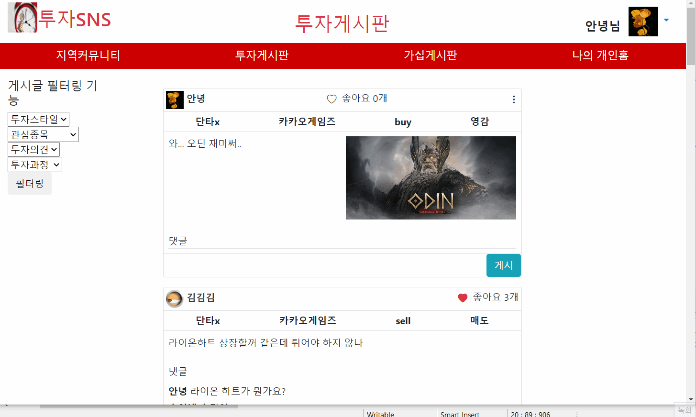

  

# Invest SNS
## 프로젝트 설명
* 투자(주식)라는 주제에 집중한 SNS
* 본인은 주식과 같은 투자를 즐기고 있다. 투자를 하면서 사람들과 소통하면 재밌을꺼 같아 만들었다.
* 간단한 웹 서비스지만, 기술들을 연습하고 적용해 본다는 의의를 가지고 만들었다.

## 사용된 기술들
* [Docker Compose](https://github.com/doriver/DockerTest01/tree/master/compose/03)
도커 컨테이너 운영에 필요한 것들( buildContext, volume등을 compose.yaml이 있는 디렉토리에서 모아서 관리 )

## 주요기능
* 회원가입,로그인,로그아웃

* 이미지 첨부 글쓰기, 좋아요,댓글기능, 글 삭제기능

* 프로필설정과 프로필 이미지 반영

* 게시글 필터링

* 위치정보 설정과 지역커뮤니티

* 다른사람의 개인홈 , 가십게시판

