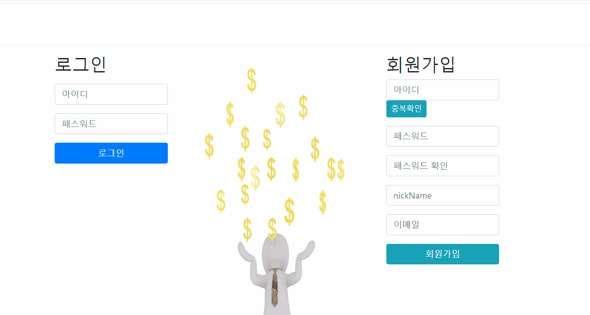

  

# Invest SNS
* 투자(주식)라는 주제에 집중한 SNS, 투자를 하면서 사람들과 소통하면 재밌을꺼 같아 만들었다.
* 간단한 웹 서비스지만, 기술들을 연습하고 적용해 본다는 의의를 가지고 만들었다.

## 사용된 기술들
* [Docker Compose](https://github.com/doriver/DockerTest01/tree/master/compose/03)
도커 컨테이너 운영에 필요한 것들( buildContext, volume등을 compose.yaml이 있는 디렉토리에서 모아서 관리 )
* [Redis with Spring](https://github.com/doriver/SpringRedis01) : 여기서 연습, 테스트 해보고 프로젝트에 적용
  * [RedisConfig.java](https://github.com/doriver/stock_invest_sns_current/blob/master/src/main/java/com/sns/invest/config/RedisConfig.java) 설정파일, [RedisDAO.java](https://github.com/doriver/stock_invest_sns_current/blob/master/src/main/java/com/sns/invest/post/dao/RedisDAO.java) 자료구조set관련 crud
* [Nginx](https://github.com/doriver/DockerTest01/blob/master/compose/03/webServer/etcNginx/conf.d/default.conf) : nginx설정 파일
## Rest API

## 인증, 로그인 처리
[SecurityConfig.java](https://github.com/doriver/stock_invest_sns_current/blob/master/src/main/java/com/sns/invest/config/SecurityConfig.java) : SecurityFilterChain을 사용해 FormLogin으로 인증처리를 함     
[src/main/java/com/sns/invest/security](https://github.com/doriver/stock_invest_sns_current/tree/master/src/main/java/com/sns/invest/security)
* UserDetailsServices를 구현해서 로그인, 권한부여를 했다.
* AuthenticationSuccessHandler를 구현해서 HttpSession에 사용자 데이터를 담음

## 요청마다 'ip주소'로 구분
[CommonFilterInterceptor.java](https://github.com/doriver/stock_invest_sns_current/blob/master/src/main/java/com/sns/invest/common/CommonFilterInterceptor.java) : ip주소 얻는 메소드 있음    
[LogInterceptor.java](https://github.com/doriver/stock_invest_sns_current/blob/master/src/main/java/com/sns/invest/common/interceptor/LogInterceptor.java) : Interceptor에서 요청마다 ip주소와 id값(UUID)을 부여하고 log로 남김

## 미리 보기
* 회원가입,로그인,로그아웃
* 프로필설정과 프로필 이미지 반영

  
  &nbsp&nbsp&nbsp
    

     
* 이미지 첨부 글쓰기, 좋아요,댓글기능, 글 삭제기능    
* 게시글 필터링

  
  &nbsp&nbsp&nbsp
    

* 위치정보 설정과 지역커뮤니티
* 다른사람의 개인홈 , 가십게시판    

  
  &nbsp&nbsp&nbsp
    

